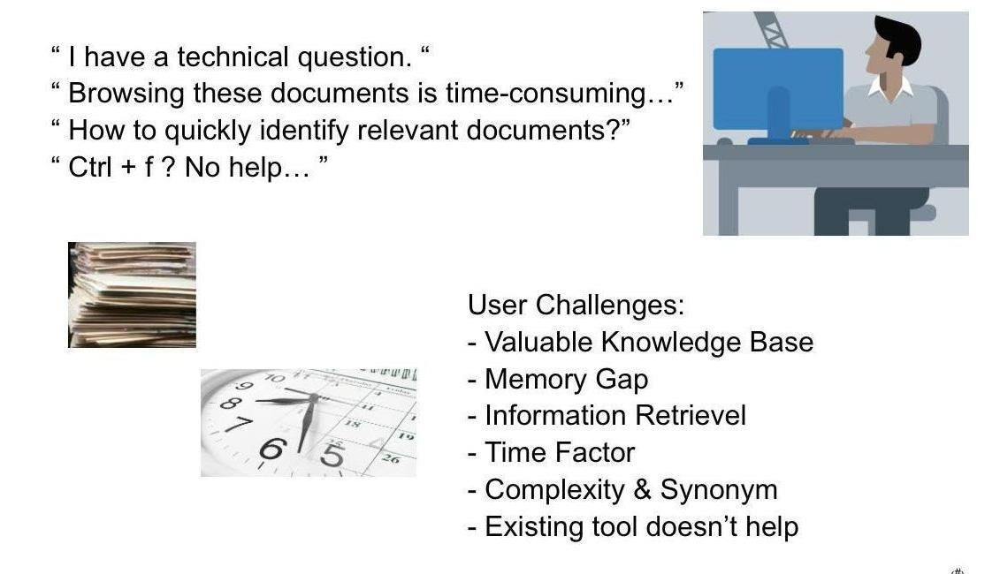
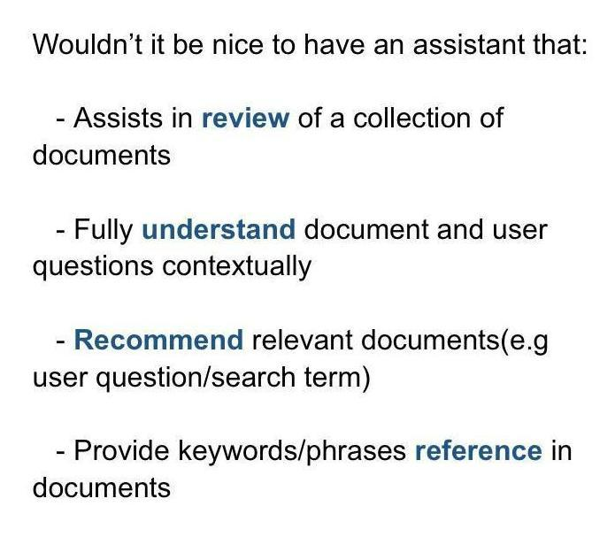
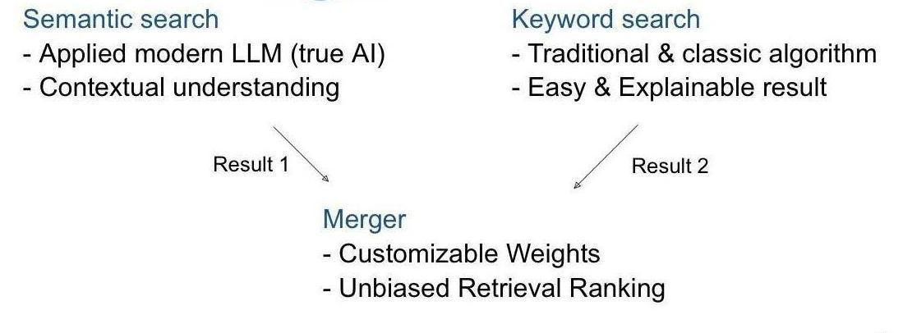
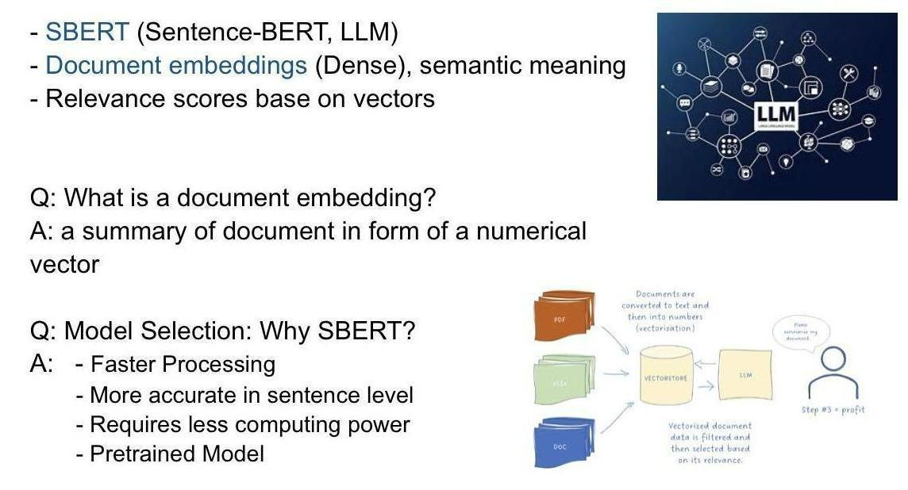
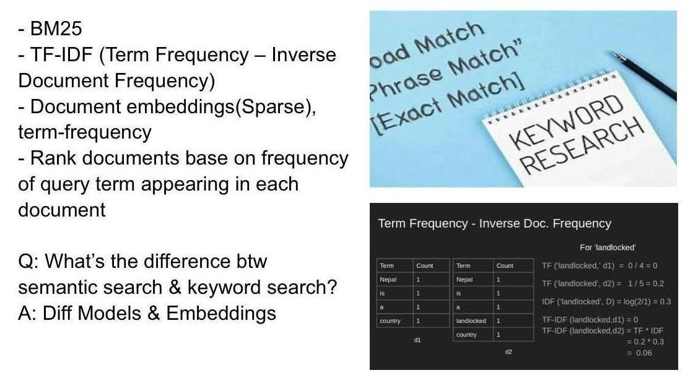
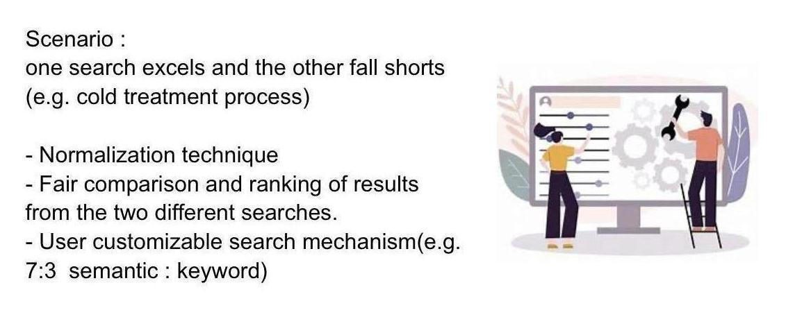
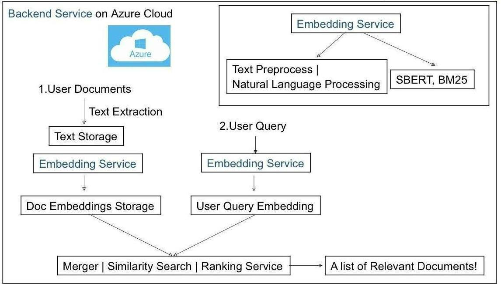
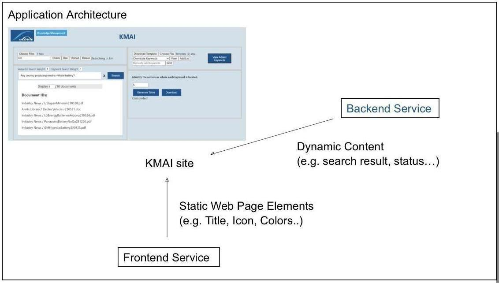

# KM Search Engine
This project is designed to revolutionize information retrieval (IR) within Linde’s knowledge management system. It consists of two main components: a Flask Backend and a React Frontend. The Backend serves as an AI-driven search engine, specifically tailored for knowledge management, while the Frontend, built with React, provides an intuitive user interface for seamless interaction with the tool.

## Business Demands & Objectives

## Author Information

- **Name**: Terry Liu
- **Release Date**: 8/21/2024

## Get Started

### Overview
In two different terminals, run the backend and frontend.

### To run the backend
1. Ensure that you have Python>=3.8 installed on your machine.
2. cd into (..\backend) to install:
pip install Flask
pip install flask-cors
pip install retriv
pip install spacy
python -m spacy download en_core_web_sm
pip install Werkzeug
3. Run the Flask application using the command `python Backend.py`.

### To run the frontend
1. Make sure you have:
- Node.js: JavaScript runtime environment that is required to run JavaScript code outside of a browser. You can download it from the official Node.js website(https://nodejs.org/en).
- npm (Node Package Manager)
2. cd into the tool2 directory (..\frontend\tool2)
2. Run the following commands:
npm install
npm start

## Dense Retriever, Sparse Retrievers, Merger

### Overview
Core components of this project and backend service. They take a user’s query and return the most relevant documents from your knowledge base.  The semantic search engine(Dense Retriever) uses a dense vector space model(SBERT) to find semantically similar documents, while the keyword-base search engine(Sparse Retriever) uses a sparse vector space model(BM25, Tf-Idf) to find documents that match the query terms. Merger plays a crucial role in fusing the results from the Sparse and Dense Retrievers to generate a comprehensive set of hybrid results. See details in (..\backend\retriv\README(Retriv).md)

### Dense Retriever (Semantic Search)
The dense retriever handles keyword matches and can handle user queries with minimal or no keywords at all. It utilizes the SBERT model to compute vector representations of queries and documents to determine relevance scores. The documents are transformed into low-dimensional vectors, each capturing more abstract meaning rather than specific words. The vector is dense as its elements are non-zero. See details in (..\backend\retriv\README(Retriv).md)

### Sparse Search Engine (Keyword-based Search)
The sparse search engine is ideal for tasks involving exact keyword match. Ituses the BM25 algorithm to rank a set of documents base on relevance score between a query and a document. The algorithm consists of three main parts: term frequency, inverse document frequency, and document length normalization. See details in (..\backend\retriv\README(Retriv).md)

### Hybrid Retriever with Merger
The Hybrid Retriever leverages both lexical and semantic matching, is composed of three integral components: the Sparse Retriever, the Dense Retriever, and the Merger. The Merger plays a crucial role in fusing the results from the Sparse and Dense Retrievers to generate a comprehensive set of hybrid results. This design ensures an unbiased approach towards any specific type of search engine and relevant results for wider range of user query. Furthermore, its customizable weight configuration allows for a personalized search experience tailored to the user’s specific needs. See details in (..\backend\retriv\README(Retriv).md)

## Backend

### Backend Overview
An AI-powered search engine support API requests from KMAI frontend. It's built on Flask, leverages Dense and Sparse Retrievers for information retrieval base on semantic meaning and lexical matching.

### Backend Architecture

### Backend Folder Structure
The folder consists of several components:
- `Backend.py`: This is the main Flask application file. It sets up the API endpoint for search and handles the search logic.
- `local_model`: This folder contains the SBERT model configuration.It is static.
- `Index_files`: This folder contains the index of documents on knowledge management site, used for performing similarity matches between user queries and documents. They are static.
- `retriv`: This folder contains wrapped classes that provide the functionality of the AI-powered search engine. It stores the model inferencing code.
- `test_backend_api.py`: Unit tests of backend API.
- `test_model_inference.py`: Module tests of the model inference.
- `all_collected_text.json`: all collected text from a sample document database, preprocessed in json format to be feed in models

### Knowledge Base (/index_files)
  /index_files folder consists of a set of documents indexed for search. The static indices are stored in files that are loaded into memory when the Flask server starts. The retrievers use these indices to find the most relevant documents for a given query.

### Testing Backend Code
You can test the backend API and the model inference using the provided test scripts. Run `python test_backend.py` and `python test_model_inference.py` to execute the tests.

## Frontend

### Frontend Overview
The Frontend is a a user-friendly interface created with React. It was bootstrapped with Create React App. It handles user interactions, manages the UI components states, and sends HTTP requests to the backend server. It also displays the results returned by the server. This frontend was bootstrapped with [Create React App](https://github.com/facebook/create-react-app).

### Frontend Architecture

### Frontend Features
- Search Bar: Users can type their queries into the search bar.
- Search History: The application keeps track of previous searches and allows users to select from them.
- Customizable Results: Users can customize the number of documents displayed for each keyword.
- Error Handling: The application handles errors gracefully and displays appropriate error messages.